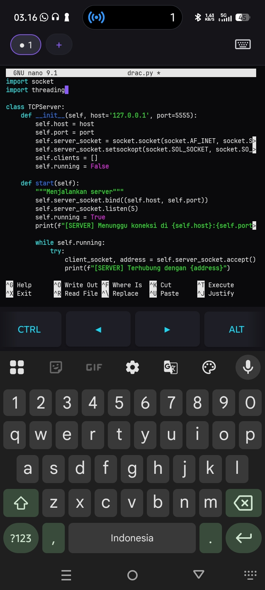
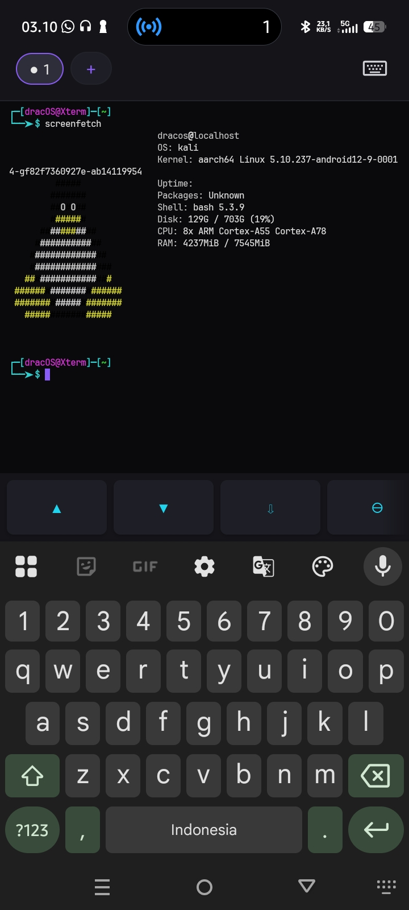
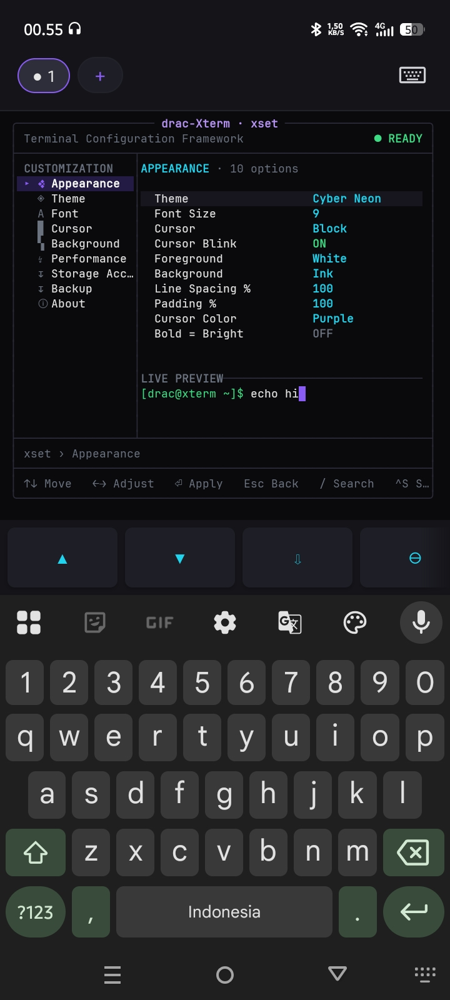
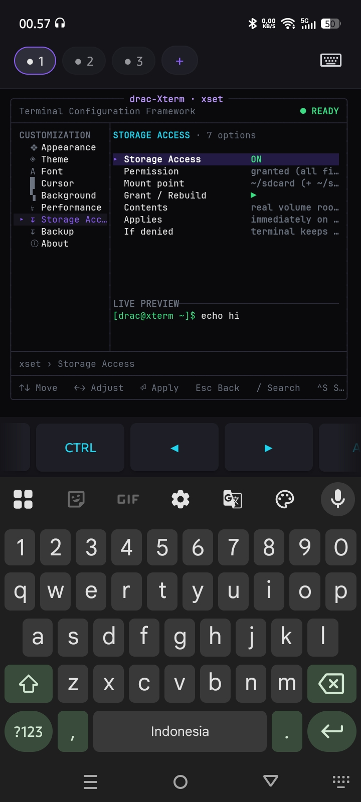
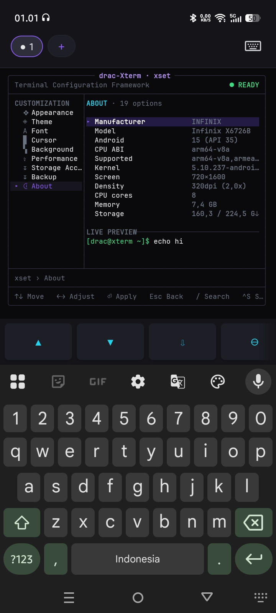

# drac-Xterm

**drac-Xterm** adalah emulator terminal Android berbasis native untuk perangkat **ARM64 (`arm64-v8a`)**. Terinspirasi oleh konsep [Termux](https://github.com/termux/termux-app)—terminal Android yang dapat menyediakan lingkungan Linux—proyek ini membangun implementasinya sendiri dengan mesin ANSI/VT, PTY, BusyBox, PRoot, dan antarmuka Kotlin.

Tanpa iklan, tanpa analitik, tanpa pustaka pelacak, tanpa akun. Aplikasi hanya membuka koneksi jaringan ketika Anda memintanya mengunduh sesuatu.

## Unduh aplikasi

APK rilis resmi diterbitkan di **[GitHub Releases](https://github.com/ExsoKamabay/dracxterm/releases)**. Setiap rilis menyertakan berkas `.apk` yang sudah ditandatangani beserta `.sha256`-nya; verifikasi checksum sebelum memasang:

```bash
sha256sum -c drac-Xterm-1.1.0-3-arm64-v8a.apk.sha256
```

Nama berkas mengikuti pola `drac-Xterm-<versionName>-<versionCode>-arm64-v8a.apk`.

> Rilis dibangun oleh GitHub Actions dari commit yang ditag, bukan dari mesin lokal. Lihat `.github/workflows/release.yml`.

## Lingkungan Linux bersifat opsional

Sejak **1.1.0** aplikasi **tidak lagi membundel** root filesystem Linux di dalam APK. Alasannya dicatat di [`docs/adr/0001-rootfs-delivery.md`](docs/adr/0001-rootfs-delivery.md): APK sebelumnya berukuran ±200 MB, jauh melampaui kuota repositori F-Droid/IzzyOnDroid, dan arsip 197 MB di Git LFS menghabiskan kuota bandwidth setelah beberapa kali klon.

Yang terjadi sekarang:

- Aplikasi langsung berjalan dengan **shell BusyBox** — sudah merupakan terminal utuh, tanpa jaringan, tanpa unduhan.
- Untuk distribusi Linux penuh, aplikasi **menawarkan sekali** untuk mengunduh image ARM64. Tidak ada byte yang diunduh sebelum Anda menekan tombolnya. Berkas diverifikasi dengan **SHA-256 terpin** sebelum diekstrak; berkas yang tidak cocok dibuang.
- Menolak tawaran itu adalah pilihan yang sah dan tidak akan ditanyakan berulang kali.
- URL dan checksum yang dipin ada di [`RootfsCatalog.kt`](app/src/main/java/com/dracxterm/rootfs/RootfsCatalog.kt) dan dapat dicocokkan ulang dengan sumber resmi lewat `scripts/verify-rootfs-catalog.sh`.

Image berasal dari [Kali NetHunter](https://www.kali.org/get-kali/#kali-mobile). Image tersebut adalah perangkat lunak pihak ketiga, bukan bagian dari drac-Xterm, dan tunduk pada lisensinya sendiri.

### Membundel RootFS sendiri saat build

Jalur ini tetap didukung penuh. Salin satu arsip rootfs arm64 ke `app/src/main/assets/rootfs/` sebelum build, maka aplikasi akan mendeteksi, memvalidasi, mengekstrak, dan menjalankannya pada peluncuran pertama—tanpa unduhan dan tanpa layar persetujuan. Lihat `app/src/main/assets/rootfs/README.txt`. **Jangan meng-commit arsipnya.**

## Build lewat terminal

Android Studio **tidak diperlukan**. Anda hanya perlu **JDK 17** dan [Android SDK Command-line Tools](https://developer.android.com/tools/sdkmanager). Persiapan sekali saja:

```bash
export ANDROID_HOME="/path/ke/Android/Sdk"
export PATH="$ANDROID_HOME/cmdline-tools/latest/bin:$PATH"
sdkmanager "platforms;android-36" "build-tools;36.0.0" "ndk;27.0.12077973" "cmake;3.22.1" && sdkmanager --licenses
```

Lalu:

```bash
./gradlew assembleDebug
```

APK ada di `app/build/outputs/apk/debug/app-debug.apk`. Build debug **tidak** memerlukan kredensial penandatanganan.

Build rilis memerlukan keystore yang disimpan **di luar** repositori dan empat properti Gradle (`DRACOS_STORE_FILE`, `DRACOS_STORE_PASSWORD`, `DRACOS_KEY_ALIAS`, `DRACOS_KEY_PASSWORD`) di `~/.gradle/gradle.properties`. Build akan gagal—bukan menghasilkan APK tanpa tanda tangan—bila kredensial tidak lengkap. Lihat [`docs/SECURITY-KEY-ROTATION.md`](docs/SECURITY-KEY-ROTATION.md).

### Uji mesin terminal

Mesin ANSI/VT diuji sebagai program C++ host, terpisah dari Android:

```bash
./native-tests/run-tests.sh
```

## Fitur

- Terminal interaktif dengan dukungan ANSI/VT dan UTF-8: warna, bentuk cursor, scrollback, layar alternatif, karakter Unicode lebar, seleksi, pencarian buffer, clipboard, mouse tracking, dan bracketed paste.
- Hingga **lima workspace** terminal independen, masing-masing dengan shell, direktori kerja, PTY, dan riwayat sendiri. Sesi dijaga foreground service saat aplikasi di latar belakang.
- Toolbar tombol navigasi, `Ctrl`, `Alt`, `Esc`, `Tab`, `Home`, `End`, `PgUp/PgDn`, tempel, pencarian, dan zoom. Pinch-to-zoom didukung.
- Perintah `xset` membuka dashboard pengaturan di dalam terminal: tema, font JetBrains Mono atau font sistem, ukuran dan spasi teks, gaya cursor, kedalaman scrollback, serta ekspor/impor konfigurasi.
- Akses penyimpanan bersifat opsional dan **tidak pernah diminta saat aplikasi dibuka**. Setelah diberikan dari pengaturan, penyimpanan internal tersedia di `~/sdcard` dan volume eksternal yang valid di `~/sdcard-1`, tanpa memulai ulang sesi aktif.
- Pada lingkungan rootfs, integrasi Ollama ARM64 tersedia lewat perintah `ollama`. Unduhan hanya berjalan setelah pengguna memintanya, diverifikasi SHA-256, lalu dipasang secara atomik; memerlukan ruang kosong sekitar 1,8 GB.

## Lisensi

Kode sumber drac-Xterm berlisensi **Apache-2.0** (lihat [`LICENSE`](LICENSE)).

APK juga mendistribusikan lima biner prebuilt pihak ketiga—BusyBox dan PRoot (GPL-2.0), talloc (LGPL-3.0), android-shmem (BSD-3-Clause). Karena drac-Xterm yang mendistribusikannya, kewajiban penyediaan source code ada pada proyek ini, bukan pada orang yang meneruskan APK-nya. Asal, versi, checksum, dan penawaran tertulis source code dicatat di [`docs/THIRD-PARTY-BINARIES.md`](docs/THIRD-PARTY-BINARIES.md); teks lisensinya ada di [`licenses/`](licenses/) dan [`NOTICE`](NOTICE).

## Screenshot aplikasi

### Editor kode dengan Nano



Tampilan editor GNU Nano yang berjalan di dalam terminal untuk menulis dan menyunting berkas kode, lengkap dengan tombol pintasan seperti `Ctrl`, navigasi, dan `Alt`.

### Informasi sistem dengan Screenfetch



Hasil perintah `screenfetch` yang menampilkan identitas lingkungan Linux, kernel, arsitektur, penggunaan disk, CPU, RAM, dan shell aktif.

### Daftar penyimpanan internal dan eksternal


Terminal memperlihatkan mount penyimpanan internal sebagai `~/sdcard` serta penyimpanan eksternal sebagai `~/sdcard-1`, termasuk isi direktori keduanya.

### Pengaturan tampilan terminal



Menu `xset` bagian **Appearance** untuk mengubah tema, font, ukuran teks, cursor, warna latar, spasi baris, padding, dan pratinjau langsung.

### Izin akses penyimpanan



Menu **Storage Access** di `xset` menunjukkan status izin penyimpanan, lokasi mount, serta opsi untuk memberikan atau membangun ulang akses penyimpanan.

### Informasi perangkat



Halaman **About** di `xset` merangkum pabrikan dan model perangkat, versi Android, ABI CPU, kernel, resolusi layar, memori, serta kapasitas penyimpanan.
